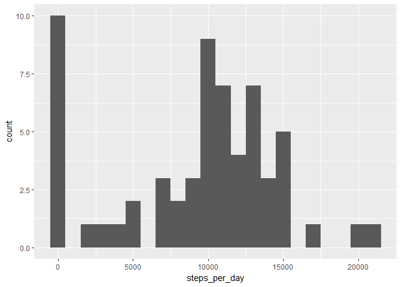

# Reproducible Research: Peer Assessment 1

## Loading and preprocessing the data

```r
activity <- read.csv("activity/activity.csv", header = T, na.strings = "NA")
head(activity)
```

```
##   steps       date interval
## 1    NA 2012-10-01        0
## 2    NA 2012-10-01        5
## 3    NA 2012-10-01       10
## 4    NA 2012-10-01       15
## 5    NA 2012-10-01       20
## 6    NA 2012-10-01       25
```


## What is mean total number of steps taken per day?
Here, we are creating a histogram of how many steps were taken each day.

```r
steps_per_day <- sapply(split(activity$steps, activity$date), sum, na.rm=T)

library(ggplot2)
print(qplot(steps_per_day, binwidth = 1000))
```

<!-- -->

```r
meansteps <- mean(steps_per_day)
mediansteps <- median(steps_per_day)
```

The mean number of steps each day is 9354.2295082. The median is 10395.


## What is the average daily activity pattern?
We split the data by the interval and compute the mean. Then, we convert to a data frame and plot the mean number of steps per interval.


```r
activity_pattern <- sapply(split(activity$steps, activity$interval), mean, na.rm=T)
activity_patternDF <- data.frame(interval = as.integer(names(activity_pattern)) , steps = activity_pattern)

print(qplot(interval, steps, data=activity_patternDF, geom="path"))
```

<!-- -->

```r
maxsteps <- activity_patternDF[which.max(activity_patternDF$steps), ]$interval
```

The interval with the highest number of steps on average is 835.

## Imputing missing values
The dataset has 2304 missing values. To correct for this, we will replace all those missing values with the mean number of steps for the particular interval. We already calculated this in the previous section, so we can use the variable activity_pattern.


```r
activity_imputed <- activity
for (i in 1:dim(activity_imputed)[1]) {
  if (is.na(activity_imputed[i,]$steps)) {
    activity_imputed[i,]$steps <- activity_pattern[as.character(activity_imputed[i,]$interval)]
  }
}

table(is.na(activity_imputed))
```

```
## 
## FALSE 
## 52704
```

Next, we repeat the histogram from the beginning.


```r
steps_per_day2 <- sapply(split(activity_imputed$steps, activity_imputed$date), sum, na.rm=T)

print(qplot(steps_per_day2, binwidth = 1000))
```

<!-- -->

We can see that the histogram appears smoother. Most notably, there are less records of zero steps in a given day.

## Are there differences in activity patterns between weekdays and weekends?

To differentiate between weekdays and weekends, we convert the date column to the Date format, then create a new column "day" which contains the day of the week of each date. From the day of the week, we create a factor variable with the levels "Weekend" and "Weekday". Using this updated data set, we create the panel plot below.


```r
library(tidyr)

activity_imputed$date <- as.Date(activity_imputed$date)
activity_imputed$day <- weekdays(activity_imputed$date)
activity_imputed$day <- factor(ifelse(activity_imputed$day %in% c("Saturday", "Sunday"), "Weekend" , "Weekday"))

activity_pattern_imp <- sapply(split(activity_imputed$steps, list(activity_imputed$interval, activity_imputed$day)), mean, na.rm=T)
activity_pattern_imp <- data.frame(key = names(activity_pattern_imp), steps = activity_pattern_imp, row.names = NULL)
activity_pattern_imp <- separate(data = activity_pattern_imp , col = key, into = c("interval", "day"), sep = "\\.")
activity_pattern_imp$interval <- as.integer(activity_pattern_imp$interval)

print(qplot(interval, steps, data=activity_pattern_imp, geom="path", facets = day ~ .))
```

<!-- -->
